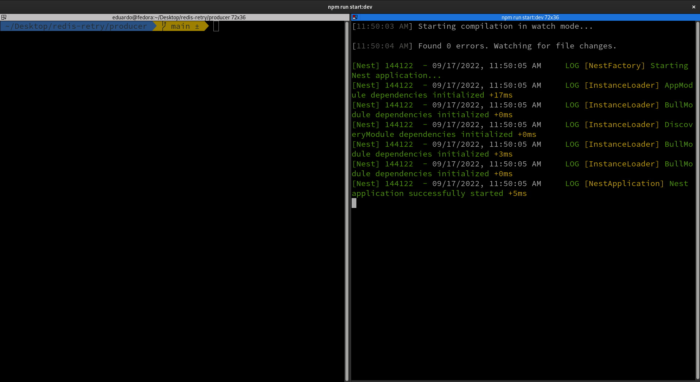
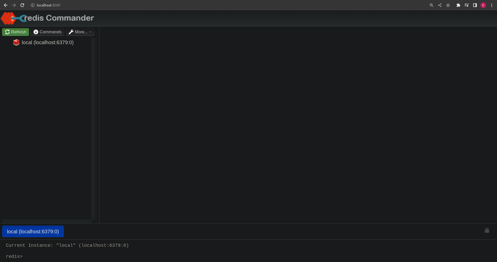
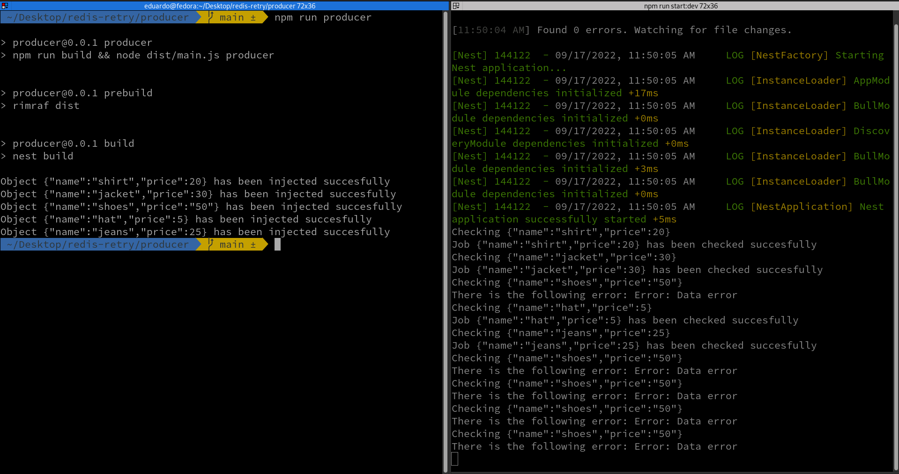
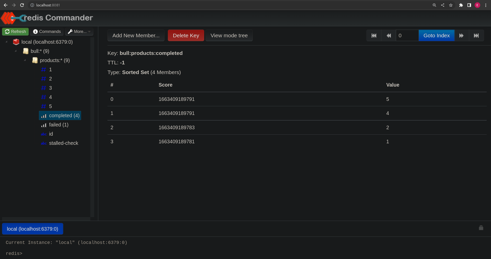
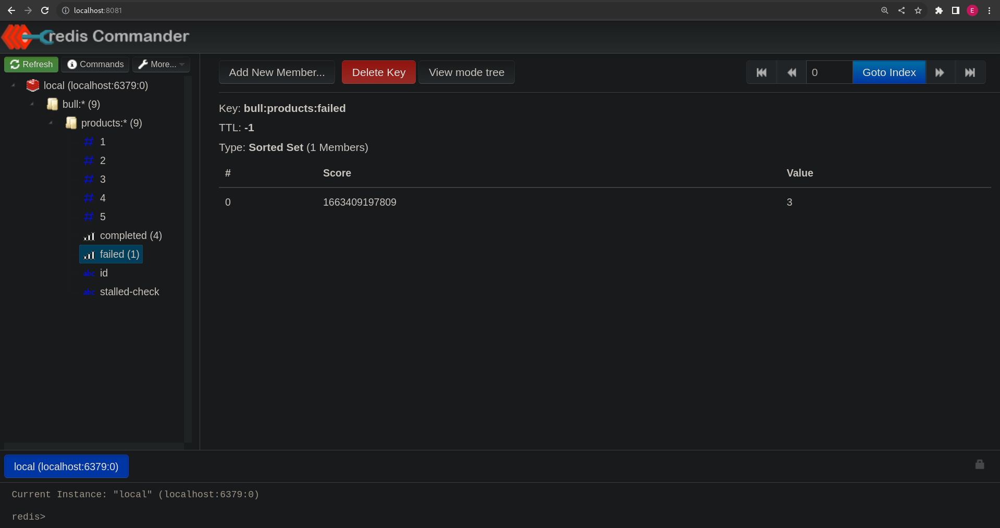
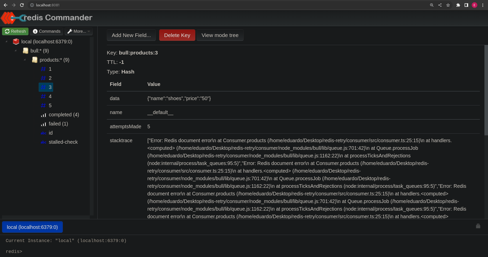

# Redis Retry

## Descripción:

En este mini proyecto vamos a trabajar con una cola de Redis y, más concretamente, con la gestión de reintentos en caso de que ocurra algún error en el script consumidor.

Básicamente, lo que hemos hecho es, preparar un producer que lanzará una serie de objetos a la cola. Estos objectos serán leídos por el consumer el cual, está preparado para detectar errores en ellos (vamos a forzar estos errores pasando desde el producer un objeto con un valor erróneo para luego detectarlo en el consumer y arrojar el correspondiente error). Una vez se detecte el error, el job correspondiente será puesto en el último lugar de la cola para realizar un reintento cuando llegue su turno (hasta un máximo de cinco reintentos). También decir que tenemos configurados los jobs de Redis para que haya un intervalo de dos segundos entre intentos.

Para esta práctica hemos empleado los commanders de NestJS (que nos permiten ejecutar scripts de NodeJS utilizando este framework), un servicio de redis (levantado con Docker) y Redis Commander (interfaz gráfica que nos permite trabajar con Redis de un manera amigable).

## Puesta en funcionamiento:

### Arrancar un servicio de Redis:

En mi caso, voy a levantar el servicio en un contenedor de docker que lo expondrá en el puerto 6379 de nuestro localhost.

### Preparar la interfaz gráfica para trabajar con Redis:

Yo he empleado Redis Commander pero existen otras que también pueden ser interesantes. Este elemento es opcional pero nos ayuda a ver de una manera sencilla cómo pasan los documentos por Redis.

### Instalar los paquetes en el producer y en el consumer:

Ejecutaremos < npm i > desde la raíz del producer y haremos lo mismo en el consumer.

### Abrir terminales:

Recomiendo abrir una terminal para el producer y otra para el consumer y poder ver de manera simultánea ambas. De esta forma controlaremos todo el proceso.

### Arrancar el consumer:

Nos dirigimos a la carpeta consumer y ejecutamos < npm run start:dev > para arrancar nuestro consumer y dejarlo a la escucha de los mensajes que lleguen desde la cola de Redis.

### Comprobar que todo está preparado:

En mi caso, he dejado las terminales preparadas de la siguiente manera:

Vemos cómo en la terminal de la izquierda tenemos en consumer preparado para ser ejecutado y en la derecha está el consumer arrancado esperando a que le lleguen los elementos de la cola de Redis.

También tenemos Redis arrancado y lo estamos visualizando a través de Redis Commander como podemos ver en la siguiente imágen:

En este momento no vemos colas ya que aún no hemos ejecutado el script del producer para lanzar los objetos.

### Lanzar el producer:

Para lanzar el producer ejecutaremos el comando < npm run producer > para ver en nuestras terminales cómo se desarrolla el proceso.

Vemos como en el consumer (parte izquierda) nos indica que los cinco objetos han sido inyectados a Redis de manera exitosa.

En la parte derecha nos indica que el tercer evento ha dado fallo y nos informa de los cuatro reintentos que ha efectuado.

Tambíen podemos ver en nuestra interfaz gráfica de Redis los eventos que han sido pasados con éxito:

Del mismo modo, también podemos ver el que ha fallado:

Vemos que en la columna value nos indica un número. Con este número podremos buscar el objeto que ha dado error y obtener información más detallada como vemos en la siguiente imágen.

Con esto ya hemos comprobado la ejecución de todo el proceso, partiendo de la salida de la información desde el producer, pasando por Redis y terminando en el consumer.
